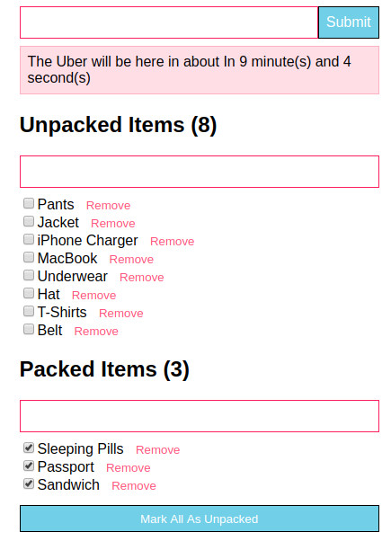

A small React app to add and remove packing items before travel (very much on the line of a to-do app) - great for fundamental understanding of state in react.

Deployed in Heroku, just click on the below image.

[](https://react-plan-items-before-travel.herokuapp.com/)

## Basic flow of Component Hierarchy in this project

```
Application.js
│
└───Items.js
│   │
│   └───Item.js
|   |___Filter.js
│
└───CountDown.js
|___NewItem.js

```

## Branching in this project

### A. master branch has the working project with simple React i.e. no Redux and not testing

### B. "redux-with-test" branch has the working project with React and Redux and testing implemented

### C. "redux-thunk-without-test" branch has the working project with React and Redux-thunk and NO testing


-------------------------------------------------------------------------

This project was bootstrapped with [Create React App](https://github.com/facebookincubator/create-react-app).

## Available Scripts

In the project directory, you can run:

### `npm start`

Runs the app in the development mode.<br>
Open [http://localhost:3000](http://localhost:3000) to view it in the browser.

The page will reload if you make edits.<br>
You will also see any lint errors in the console.

### `npm test`

Launches the test runner in the interactive watch mode.<br>
See the section about [running tests](#running-tests) for more information.

### `npm run build`

Builds the app for production to the `build` folder.<br>
It correctly bundles React in production mode and optimizes the build for the best performance.

The build is minified and the filenames include the hashes.<br>
Your app is ready to be deployed!

See the section about [deployment](#deployment) for more information.

### `npm run eject`

**Note: this is a one-way operation. Once you `eject`, you can’t go back!**
